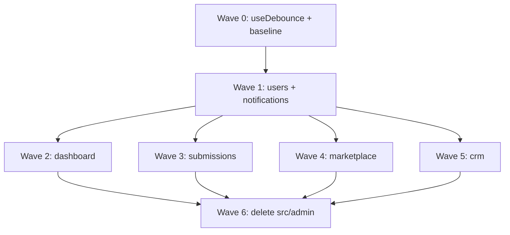

# Phase 10: Restructure src/admin — Research

**Researched:** 2026-06-15  
**Domain:** Next.js App Router admin module restructuring (file layout + import migration)  
**Confidence:** HIGH

## Summary

Phase 10 is a **pure structural refactor**: move ~82 files out of monolithic `src/admin/` into a three-layer layout that matches the unified app's public-site conventions — routes in `src/app/admin/`, UI in `src/components/admin/{domain}/`, and non-UI domain code in `src/features/{domain}/`. No API, database, or auth behavior changes are required.

The codebase already has partial migration stubs: `src/features/marketplace/{constants,utils/uploadPaths}` and `src/features/crm/types.ts` are **byte-identical duplicates** of their `src/admin/` counterparts and are already consumed by API routes (`src/app/api/marketplace/upload/*`, `src/app/api/activity/route.ts`). [VERIFIED: codebase grep + file diff]

Current `@/admin/` import surface: **~56 files**, **~120 import statements** across `src/admin/`, `src/app/admin/`, `src/components/admin/`, and `src/components/shared/CrmViewBar.tsx`. [VERIFIED: ripgrep count in `src/`]

**Primary recommendation:** Adopt the locked 3-layer layout below, migrate in dependency order (users → notifications → dashboard → submissions → marketplace → crm), consolidate duplicate hooks/constants during Wave 0, split 3 files over 300 lines as part of CRM/marketplace waves, and gate with `phase10:grep-gate` (zero `@/admin/` refs) + `check-types` + `build`.

<user_constraints>
## User Constraints (from phase intent — no CONTEXT.md)

### Locked Decisions
- **Eliminate `src/admin/`** — no monolithic admin layer after phase completes
- **Colocate with `app/` and `components/`** — admin code lives alongside existing public-site structure, not a parallel tree
- **Split into smaller modules** — domain-sized slices (crm, marketplace, dashboard, submissions, users, notifications)
- **File size rule:** React components must stay under **300 lines** (split during migration where violated)
- **Depends on Phase 9** — CRM prune complete; no tasks/automations/pipeline/custom-fields modules remain

### Claude's Discretion
- Exact subfolder naming under `components/admin/{domain}/` (e.g. `pages/` vs colocated `_components/` in app routes)
- Whether to move `CrmViewBar` to `components/admin/crm/` vs keep in `components/shared/` with updated imports
- `useDebounce` canonical path (`@/hooks/` vs `@/lib/hooks/`) — must pick one and migrate all callers
- Barrel `index.ts` files per domain (keep vs delete in favor of direct imports)

### Deferred Ideas (OUT OF SCOPE)
- Admin UX redesign (Phase 5)
- Schema dedup / type safety overhaul (Phase 4)
- New ESLint boundary enforcement wiring
- Automated test framework introduction
</user_constraints>

## Standard Stack

### Core
| Library | Version | Purpose | Why Standard |
|---------|---------|---------|--------------|
| Next.js | 16.1.0 (project) / 16.2.9 (npm latest) | App Router, route colocation | Already unified app; no new framework [VERIFIED: package.json, npm registry] |
| React | 19.2.x | Admin UI | Existing stack [VERIFIED: package.json] |
| TypeScript | 5.9.2 | Import path safety during move | `tsc --noEmit` catches broken `@/admin/*` refs [VERIFIED: package.json] |
| `@/*` path alias | `./src/*` | Stable imports after restructure | Unchanged — only path targets change [VERIFIED: tsconfig.json] |

### Supporting
| Library | Version | Purpose | When to Use |
|---------|---------|---------|-------------|
| ESLint 9 | ^9.39.1 | Lint gate | `npm run lint` after each wave [VERIFIED: package.json] |
| Zod | ^4.3.2 | CRM/marketplace schemas move with features | `@/features/{domain}/schemas` [VERIFIED: existing admin schemas] |
| `@tanstack/react-table` | ^8.21.3 | CRM/submissions tables | Components stay in `components/admin/` [VERIFIED: admin pages] |

### Alternatives Considered
| Instead of | Could Use | Tradeoff |
|------------|-----------|----------|
| `features/` + `components/admin/` split | Full Next.js route colocation (`app/**/_components/`) | Route colocation scatters domain UI across many route folders; harder grep/barrel; conflicts with existing `components/admin/` shell |
| Keep thin `page.tsx` re-exports | Inline page components in `app/admin/**/page.tsx` | Works for small pages; 3 pages exceed 300 lines — would violate file-size rule |
| `@/lib/admin/` for services | `@/features/{domain}/` | `features/` already used by API routes for marketplace + crm types; extending it avoids a fourth top-level folder |

**Installation:** None — no new packages.

## Target Directory Layout (LOCKED)

```
src/
├── app/admin/
│   ├── login/page.tsx                    # thin: export from components/admin/users/pages/LoginPage
│   └── (portal)/
│       ├── layout.tsx                    # unchanged → AdminPortalLayout
│       ├── page.tsx                      # thin → dashboard
│       ├── leads/page.tsx                # thin → components/admin/crm/pages/LeadsPage
│       ├── deals/page.tsx
│       ├── customers/page.tsx
│       ├── messages/page.tsx
│       ├── items/page.tsx
│       ├── featured/page.tsx
│       ├── marketplace/new/page.tsx
│       ├── marketplace/edit/[id]/page.tsx
│       ├── submissions/page.tsx
│       ├── verify/page.tsx
│       ├── logs/page.tsx
│       ├── users/page.tsx
│       ├── profile/page.tsx              # consolidate duplicate (see Risks)
│       └── settings/page.tsx             # already inline — no @/admin refs
│
├── components/admin/
│   ├── shell/                            # PortalSidebar.tsx, AdminPortalLayout.tsx (move from components/admin/)
│   ├── crm/
│   │   ├── pages/                        # LeadsPage, DealsPage, CustomersPage, MessagesPage
│   │   ├── components/                   # DealForm, ActivityFeed, AttachmentsPanel, …
│   │   └── CrmViewBar.tsx                # move from components/shared/ (CRM-specific)
│   ├── marketplace/
│   │   ├── pages/                        # ItemsPage, FeaturedPage, NewMarketplacePage, EditMarketplacePage
│   │   ├── MarketplaceForm.tsx           # orchestrator (<300 lines after split)
│   │   └── form/                         # merge marketplace-form/* sections here
│   ├── dashboard/
│   │   ├── pages/                        # DashboardPage, LogsPage
│   │   └── components/                   # StatsGrid, FunnelSummaryCard, …
│   ├── submissions/
│   │   ├── pages/                        # SubmissionsPage, VerifyPage
│   │   └── components/                   # SubmissionsTable, AdvancedSearch, …
│   ├── notifications/
│   │   └── components/                   # NotificationCenter, NotificationItem
│   └── users/
│       ├── pages/                        # LoginPage, UsersPage, ProfilePage (single source)
│       └── components/                   # (if any extracted)
│
├── features/                             # Non-UI domain layer (services, hooks, types, schemas)
│   ├── crm/
│   │   ├── services/                     # 10 service files from admin/crm/services
│   │   ├── hooks/                        # useAttachmentsUpload
│   │   ├── types.ts                      # keep (already used by API)
│   │   ├── schemas.ts
│   │   └── index.ts                      # optional barrel
│   ├── marketplace/
│   │   ├── services/marketplaceService.ts
│   │   ├── hooks/useMarketplaceTempUploads.ts
│   │   ├── constants.ts                  # keep (already used by API) — DELETE admin duplicate
│   │   ├── schema.ts
│   │   ├── utils/uploadPaths.ts          # keep (already used by API)
│   │   └── types.ts
│   ├── dashboard/
│   │   ├── services/                     # dashboardService, auditLogsService
│   │   └── types.ts
│   ├── submissions/
│   │   ├── services/consignedService.ts
│   │   └── types.ts
│   ├── notifications/
│   │   ├── services/                     # notificationsService, notificationPreferencesService
│   │   └── types.ts
│   └── users/
│       ├── services/usersService.ts
│       ├── hooks/useProfile.ts
│       └── types.ts
│
└── admin/                                # DELETE entirely after Wave 6
```

**Routing rule:** Every `src/app/admin/**/page.tsx` stays a **one-line thin re-export** (or minimal wrapper for dynamic routes like `edit/[id]`). Page implementations live in `components/admin/{domain}/pages/`.

**Logic rule:** Any file that calls `fetch('/api/...')` or defines Zod schemas/types/hooks without JSX → `features/{domain}/`.

**UI rule:** Any `.tsx` with JSX → `components/admin/{domain}/`.

## Import Path Migration Map

| Old path | New path | Notes |
|----------|----------|-------|
| `@/admin/users/hooks/useProfile` | `@/features/users/hooks/useProfile` | **Highest fan-out** — shell + all CRM pages + CrmViewBar |
| `@/admin/users/services/*` | `@/features/users/services/*` | |
| `@/admin/users/pages/*` | `@/components/admin/users/pages/*` | |
| `@/admin/notifications/components/*` | `@/components/admin/notifications/components/*` | |
| `@/admin/notifications/services/*` | `@/features/notifications/services/*` | |
| `@/admin/dashboard/pages/*` | `@/components/admin/dashboard/pages/*` | |
| `@/admin/dashboard/components/*` | `@/components/admin/dashboard/components/*` | |
| `@/admin/dashboard/services/*` | `@/features/dashboard/services/*` | |
| `@/admin/submissions/pages/*` | `@/components/admin/submissions/pages/*` | |
| `@/admin/submissions/components/*` | `@/components/admin/submissions/components/*` | |
| `@/admin/submissions/services/*` | `@/features/submissions/services/*` | |
| `@/admin/marketplace/pages/*` | `@/components/admin/marketplace/pages/*` | |
| `@/admin/marketplace/components/MarketplaceForm` | `@/components/admin/marketplace/MarketplaceForm` | Split to <300 lines |
| `@/admin/marketplace/hooks/*` | `@/features/marketplace/hooks/*` | |
| `@/admin/marketplace/services/*` | `@/features/marketplace/services/*` | |
| `@/admin/marketplace/constants` | `@/features/marketplace/constants` | Delete `src/admin/marketplace/constants.ts` |
| `@/admin/marketplace/utils/uploadPaths` | `@/features/marketplace/utils/uploadPaths` | Delete admin duplicate |
| `@/admin/marketplace/schema` | `@/features/marketplace/schema` | Update marketplace-form section imports |
| `@/admin/crm/pages/*` | `@/components/admin/crm/pages/*` | Split 3 pages >300 lines |
| `@/admin/crm/components/*` | `@/components/admin/crm/components/*` | |
| `@/admin/crm/services/*` | `@/features/crm/services/*` | |
| `@/admin/crm/hooks/*` | `@/features/crm/hooks/*` | |
| `@/admin/crm/types` | `@/features/crm/types` | Delete admin duplicate |
| `@/admin/crm/schemas` | `@/features/crm/schemas` | |
| `@/components/admin/marketplace-form/*` | `@/components/admin/marketplace/form/*` | Optional rename during marketplace wave |
| `@/components/shared/CrmViewBar` | `@/components/admin/crm/CrmViewBar` | Update 4 CRM page imports |
| `@/hooks/useDebounce` | `@/hooks/useDebounce` (canonical) | Migrate `@/lib/hooks/useDebounce` callers |
| `@/lib/hooks/useDebounce` | `@/hooks/useDebounce` | Re-export shim optional, then delete duplicate |

**Barrel files:** `src/admin/{domain}/index.ts` exports are **not imported externally** (pages use direct paths). Safe to delete with domain folder — no re-export shim period needed. [VERIFIED: grep shows no `@/admin/crm` barrel imports, only leaf paths]

## Wave Ordering

| Wave | Domain | Files | Rationale | Gate |
|------|--------|-------|-----------|------|
| **0** | Prep | — | `useDebounce` consolidation; `phase10:grep-baseline`; split plan for 3 oversized files | baseline recorded |
| **1** | users + notifications | 14 | `useProfile` imported by shell, CRM, CrmViewBar; `NotificationCenter` in layout | typecheck |
| **2** | dashboard | 14 | No `@/admin/crm` deps; low coupling | typecheck |
| **3** | submissions | 11 | Isolated; uses `@/hooks/useDebounce` only | typecheck |
| **4** | marketplace | 12 + 7 form sections | Merge duplicate `features/` stubs; update form section schema imports; split `MarketplaceForm` (478 lines) | typecheck |
| **5** | crm | 31 + CrmViewBar | Largest domain; depends on users/features paths; split LeadsPage (355), CustomersPage (346) | typecheck |
| **6** | Cleanup | — | Delete `src/admin/`; delete duplicate constants/types/uploadPaths in admin tree; `phase10:grep-gate` + build | full gate |

**Dependency graph:**



## Architecture Patterns

### Pattern 1: Thin Route, Fat Component
**What:** `page.tsx` only re-exports the page component from `components/admin/{domain}/pages/`.  
**When:** All admin portal routes (existing pattern preserved).  
**Example:**
```typescript
// src/app/admin/(portal)/leads/page.tsx
export { default } from "@/components/admin/crm/pages/LeadsPage";
```

### Pattern 2: Features Layer for API-Facing Logic
**What:** Services, hooks, types, schemas live in `src/features/{domain}/` — shared by admin UI and Route Handlers.  
**When:** Any module already partially in `features/` (marketplace, crm types).  
**Example:**
```typescript
// src/features/marketplace/constants.ts — already consumed by:
// src/app/api/marketplace/upload/route.ts
import { MARKETPLACE_UPLOAD_BUCKET } from "@/features/marketplace/constants";
```

### Pattern 3: Domain UI Under components/admin
**What:** JSX components grouped by domain mirroring old `admin/{domain}/components` structure.  
**When:** All admin-specific presentation (not shared with public site).

### Anti-Patterns to Avoid
- **Shim re-export layer:** Do not create `@/admin/index.ts` pointing to new paths — grep gate must hit zero.
- **Duplicating features/ in admin/:** Delete admin copies of `constants.ts`, `uploadPaths.ts`, `crm/types.ts` immediately when marketplace/crm waves land.
- **Moving shell into features/:** `AdminPortalLayout` stays UI in `components/admin/shell/`.
- **Inline 300+ line pages in app/:** Violates file-size rule; keep pages in `components/admin/.../pages/` and split.

## Don't Hand-Roll

| Problem | Don't Build | Use Instead | Why |
|---------|-------------|-------------|-----|
| Import rewrite across 120+ statements | Manual one-by-one without script | `git mv` + IDE rename symbol + grep gate | Miss one `@/admin/` → build passes until runtime |
| Custom module boundary lint | New ESLint plugin this phase | `phase10:grep-gate.mjs` (copy phase9 pattern) | Phase scope is move-only; boundary rules exist but unwired [VERIFIED: eslint.config.js] |
| Duplicate debounce hook | Keep two copies | Single `@/hooks/useDebounce` | Identical implementations [VERIFIED: file diff] |
| Third marketplace constants file | New path | Extend existing `@/features/marketplace/constants` | API already depends on it |

## Runtime State Inventory

| Category | Items Found | Action Required |
|----------|-------------|-----------------|
| Stored data | None — no DB keys or localStorage keys use `@/admin/` paths | Code edit only [VERIFIED: grep `@/admin` in supabase/, no matches] |
| Live service config | None — Vercel/Supabase config unaffected | None |
| OS-registered state | None | None |
| Secrets/env vars | None — `@/*` alias unchanged; no env var names reference `admin/` paths | None |
| Build artifacts | `.next/` may cache old module paths | `npm run build` clean build after Wave 6 [VERIFIED: .next in gitignore] |

## Common Pitfalls

### Pitfall 1: CrmViewBar Cross-Layer Coupling
**What goes wrong:** `components/shared/CrmViewBar.tsx` imports four `@/admin/crm/services/*` and `@/admin/users/hooks/useProfile` — shared folder depends on admin monolith.  
**Why it happens:** CrmViewBar placed in `shared/` during Phase 1 merge before structure finalized.  
**How to avoid:** Move to `components/admin/crm/CrmViewBar.tsx` in CRM wave; update imports to `@/features/crm/services/*` and `@/features/users/hooks/useProfile`.  
**Warning signs:** `components/shared/` importing from `@/features/crm` or `@/components/admin`.

### Pitfall 2: Duplicate useDebounce
**What goes wrong:** Admin CRM/submissions use `@/hooks/useDebounce`; public site uses `@/lib/hooks/useDebounce` — identical 17-line files.  
**Why it happens:** Phase 6 flatten merged two monorepo apps with different hook locations.  
**How to avoid:** Wave 0 — canonicalize to `@/hooks/useDebounce` (matches `components.json` aliases); change 2 public callers (`ConsignForm`, `MarketplaceSearch`); delete `lib/hooks/useDebounce.ts`.  
**Warning signs:** grep finds two `export function useDebounce` definitions.

### Pitfall 3: Marketplace Triple Split
**What goes wrong:** Marketplace UI spans three trees: `admin/marketplace/`, `components/admin/marketplace-form/`, `features/marketplace/`.  
**Why it happens:** Incremental extract of form sections without finishing move.  
**How to avoid:** Wave 4 merges into `components/admin/marketplace/form/` + `features/marketplace/`; delete all `admin/marketplace/` files.  
**Warning signs:** Two `constants.ts` or two `uploadPaths.ts` remain after wave.

### Pitfall 4: Profile Page Duplication
**What goes wrong:** Full `ProfilePage` exists in both `src/app/admin/(portal)/profile/page.tsx` (254 lines, inline) and `src/admin/users/pages/ProfilePage.tsx` (likely duplicate).  
**Why it happens:** Route was inlined without removing admin copy.  
**How to avoid:** Wave 1 — single source in `components/admin/users/pages/ProfilePage.tsx`; app route thin re-export.  
**Warning signs:** Two files both import `useProfile` + `notificationPreferencesService`.

### Pitfall 5: Oversized Components Block Merge
**What goes wrong:** Moving 478-line `MarketplaceForm.tsx` without splitting violates 300-line rule and increases review risk.  
**Files over 300 lines today:** [VERIFIED: line count]
- `src/admin/marketplace/components/MarketplaceForm.tsx` — **478 lines**
- `src/admin/crm/pages/LeadsPage.tsx` — **355 lines**
- `src/admin/crm/pages/CustomersPage.tsx` — **346 lines**  
**How to avoid:** Split as part of domain wave (extract table columns, detail panels, form footer/submit into subcomponents).

## Gate Strategy

### Grep gate (new script)
Model after `scripts/phase9-grep-gate.mjs` [VERIFIED: existing script]:

```javascript
// scripts/phase10-grep-gate.mjs
const PATTERNS = ["@/admin/", "from '@/admin/", 'from "@/admin/'];
// Also forbid resurrected path:
const FORBIDDEN_DIRS = ["src/admin/"]; // optional directory existence check
```

**package.json scripts to add:**
```json
"phase10:grep-baseline": "node scripts/phase10-grep-gate.mjs --baseline",
"phase10:grep-gate": "node scripts/phase10-grep-gate.mjs",
"phase10:gate": "npm run phase10:grep-gate && npm run check-types && npm run build"
```

### Per-wave verification
```bash
# After each wave
npm run check-types

# After wave 6 (final)
npm run phase10:gate
npm run lint
```

### Success criteria
1. `rg '@/admin/' src/` → **0 matches**
2. `src/admin/` directory **does not exist**
3. `npm run check-types` passes
4. `npm run build` passes
5. No component file introduced or moved exceeds **300 lines** (except explicit Wave 0 waiver list must be empty at gate)

## Code Examples

### Thin page re-export (preserve existing pattern)
```typescript
// src/app/admin/(portal)/deals/page.tsx
export { default } from "@/components/admin/crm/pages/DealsPage";
```

### Service import after CRM wave
```typescript
// src/components/admin/crm/CrmViewBar.tsx
import { crmViewsService, type CrmSavedView, type CrmEntityType } from "@/features/crm/services/crmViewsService";
import { useProfile } from "@/features/users/hooks/useProfile";
import { crmSearchesService, type CrmRecentSearch } from "@/features/crm/services/crmSearchesService";
import { crmFiltersService, type CrmSavedFilter } from "@/features/crm/services/crmFiltersService";
```

### Marketplace form schema import (after wave 4)
```typescript
// src/components/admin/marketplace/form/BasicInfoSection.tsx
import { MarketplaceFormData } from "@/features/marketplace/schema";
```

## State of the Art

| Old Approach | Current Approach | When Changed | Impact |
|--------------|------------------|--------------|--------|
| `apps/admin/src/features/` | `src/admin/{domain}/` | Phase 1 merge | Monolithic admin layer — **target for removal** |
| Partial `src/features/` stubs | API uses `@/features/marketplace/*` | Phase 6 flatten | Establishes `features/` as server-shared logic home |
| `components/admin/marketplace-form/` | Form sections extracted from MarketplaceForm | Phase 1+ | Merge into `components/admin/marketplace/form/` |

**Deprecated/outdated:**
- `src/admin/**` — entire tree deleted Wave 6
- `src/lib/hooks/useDebounce.ts` — delete after Wave 0 consolidation
- Duplicate `ProfilePage` in app route — consolidate Wave 1

## Assumptions Log

| # | Claim | Section | Risk if Wrong |
|---|-------|---------|---------------|
| A1 | No external packages import `@/admin/*` | Import map | Low — monorepo is single app; grep `src/` sufficient |
| A2 | Barrel `index.ts` files unused externally | Wave 6 | Medium — verify grep `@/admin/crm"` before delete |
| A3 | `settings/page.tsx` stays inline (no admin deps) | Wave ordering | Low — already self-contained stub UI |

## Open Questions (RESOLVED)

1. **Rename `marketplace-form/` → `marketplace/form/`?** — **RESOLVED:** Yes, during Wave 4 (Plan 05). See CONTEXT.md.
2. **Keep `components/shared/CrmViewBar` path as re-export shim?** — **RESOLVED:** No. Move file + update 4 imports (Plan 06). See CONTEXT.md.

## Environment Availability

| Dependency | Required By | Available | Version | Fallback |
|------------|------------|-----------|---------|----------|
| Node.js | build/typecheck | ✓ | v25.2.1 | engines `>=20` [VERIFIED: shell] |
| npm | scripts | ✓ | 11.6.2 | — |
| TypeScript | check-types | ✓ | 5.9.2 (project) | — |
| Next.js dev server | Manual UAT | ✓ | 16.1.0 | — |

**Missing dependencies with no fallback:** None

## Validation Architecture

### Test Framework
| Property | Value |
|----------|-------|
| Framework | none — project quality gate is lint + typecheck + build [VERIFIED: no *.test.* files] |
| Config file | none |
| Quick run command | `npm run check-types` |
| Full suite command | `npm run phase10:gate` |

### Phase Requirements → Test Map
| Req ID | Behavior | Test Type | Automated Command | File Exists? |
|--------|----------|-----------|-------------------|-------------|
| RESTR-10-01 | Zero `@/admin/` imports | grep gate | `npm run phase10:grep-gate` | ❌ Wave 0 — create script |
| RESTR-10-02 | TypeScript compiles after moves | typecheck | `npm run check-types` | ✅ |
| RESTR-10-03 | Production build succeeds | build | `npm run build` | ✅ |
| RESTR-10-04 | Admin routes render | manual smoke | Dev server: hit `/admin`, `/admin/leads`, `/admin/items` | manual |
| RESTR-10-05 | Components ≤300 lines | static check | `wc -l` on moved `.tsx` or CI script | ❌ Wave 0 — add to gate optional |

### Sampling Rate
- **Per task commit:** `npm run check-types`
- **Per wave merge:** `npm run check-types && npm run lint`
- **Phase gate:** `npm run phase10:gate`

### Wave 0 Gaps
- [ ] `scripts/phase10-grep-gate.mjs` — forbidden `@/admin/` pattern
- [ ] `package.json` — `phase10:grep-baseline`, `phase10:grep-gate`, `phase10:gate` scripts
- [ ] `useDebounce` consolidation — delete duplicate in `lib/hooks/`
- [ ] File-size split plan for MarketplaceForm, LeadsPage, CustomersPage

## Security Domain

Refactor-only phase — no new auth surface. Preserve existing patterns:

| ASVS Category | Applies | Standard Control |
|---------------|---------|-----------------|
| V2 Authentication | no change | Existing Supabase session + middleware |
| V4 Access Control | no change | `requireUser`/`requireRole` on API routes unchanged |
| V5 Input Validation | no change | Zod schemas move with files, not modified |

| Pattern | STRIDE | Standard Mitigation |
|---------|--------|---------------------|
| Broken import → runtime fetch to wrong service | Tampering | typecheck + build + manual route smoke |
| Accidental public exposure of admin component | Info disclosure | Admin components stay client-only under `/admin` layout |

## Project Constraints (from .cursor/rules/)

- **graphify:** Run graph rebuild after code file modifications [VERIFIED: graphify.mdc]
- **GSD workflow:** Phase executed via `/gsd-plan-phase` → `/gsd-execute-phase` [VERIFIED: CLAUDE.md]
- **shadcn-guard:** Do not edit `components/ui/**` directly — wrappers only [VERIFIED: CLAUDE.md]
- **Quality gate:** lint + typecheck + build (no Vitest) [VERIFIED: CLAUDE.md]

## Sources

### Primary (HIGH confidence)
- Codebase inventory — `src/admin/` 82 files across 6 domains [VERIFIED: glob + count]
- Ripgrep `@/admin/` — 56 files, ~120 imports [VERIFIED: grep]
- Duplicate file comparison — `features/marketplace/constants.ts` ≡ `admin/marketplace/constants.ts` [VERIFIED: read]
- `scripts/phase9-grep-gate.mjs` — gate pattern template [VERIFIED: read]
- `tsconfig.json` — `@/*` → `./src/*` [VERIFIED: read]
- `package.json` — scripts and dependencies [VERIFIED: read]

### Secondary (MEDIUM confidence)
- `.planning/codebase/STRUCTURE.md` — documents current layout (pre-phase-10) [VERIFIED: read]
- `.planning/codebase/CONVENTIONS.md` — naming patterns to update post-move [VERIFIED: read]

### Tertiary (LOW confidence)
- Next.js route colocation best practices — not required given locked 3-layer layout [ASSUMED]

## Metadata

**Confidence breakdown:**
- Standard stack: HIGH — no new libraries; verified package versions
- Architecture: HIGH — based on full import graph and existing partial `features/` migration
- Pitfalls: HIGH — verified CrmViewBar, useDebounce, duplicates, file sizes in codebase

**Research date:** 2026-06-15  
**Valid until:** 2026-07-15 (stable refactor patterns)
