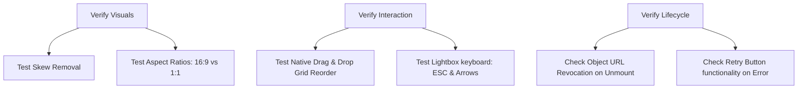

# Phase 16 Research — Marketplace Editor Image Upload UX

## Research Findings

### 1. Slanted clip-path / Skew Removal
- **Issues:**
  - `MarketplaceImageSection.tsx` currently applies brand slant clip-path utilities (`.clip-path-slant-lg` and `.clip-path-slant`) to image previews and drop zones.
  - This results in a skewed parallelogram border-box. Because the standard `` inside is styled with `absolute inset-0 w-full h-full object-cover`, the diagonals clip and cut off the image corners.
  - The remove button (`X` icon) also uses `clip-path-slant` and sits inside the clipped zone, overlapping awkwardly.
- **Solution:** 
  - Remove all clip-path slant classes from `MarketplaceImageSection.tsx`.
  - Use clean standard borders and standard shadows matching the design system (e.g., `rounded-lg border border-border/60 bg-surface/30`).

### 2. Aspect Ratio and Grid Constraints
- **Cover Image:** Must be styled with `aspect-ratio: 16/9` instead of a fixed height (`h-48`). Use Tailwind's `aspect-video` class for standard `16:9` ratio and `object-cover` to prevent distortion.
- **Additional Images Grid:** 
  - Grid columns must support a responsive layout: `grid-cols-2 sm:grid-cols-3 md:grid-cols-4 gap-4`.
  - Each item must be a square tile (`aspect-square` instead of `h-32`) to keep previews uniform regardless of dimensions.
- **Actions overlay:**
  - Cover image needs a dual action footer or hover overlay: `Replace` (trigger input file selection) and `Remove` (trash action).
  - Additional thumbnails should have a simple hover action or a small top-right delete button (`w-8 h-8 rounded-full` instead of skewed polygons).

### 3. Lightbox Interaction Model
- **Trigger:** Clicking on any successfully uploaded cover image or additional image thumbnail opens the Lightbox.
- **Controls & Accessibility:**
  - **Backdrop:** Semitransparent dark overlay (`bg-black/90 backdrop-blur-md`).
  - **Scale & Contain:** Image rendered with `max-w-full max-h-[85vh] object-contain` to fit screen bounds without cropping.
  - **Keyboard:** Listeners for `Escape` (close), `ArrowLeft` (previous slide), and `ArrowRight` (next slide).
  - **Index Display:** Header showing `[Current Index] / [Total Count]` (e.g., `2 / 5`).
  - **Focus Trap:** Ensure pressing Tab loops focus inside the lightbox close/nav buttons.
  - **Scroll Lock:** Apply `overflow: hidden` on the `document.body` or use a portal component that handles it automatically.

### 4. Upload States, Retries, and URL Lifecycle
- **Progress & Failures:**
  - `useMarketplaceFormImages` manages upload states: `idle`, `uploading`, `uploaded`, `error`.
  - When an upload fails (`status === "error"`), overlay showing an "Upload Failed" error state with a **Retry** button should appear.
  - The retry button should re-trigger the upload service using the cached file reference (`item.file`).
- **Object URL Cleanup:**
  - Previews created via `URL.createObjectURL(file)` must be cleaned up using `URL.revokeObjectURL(url)` on:
    - Target image removal.
    - Image replacement/override.
    - Component unmounting (to prevent browser memory leaks).

---

## Files to Modify or Create

### 1. `src/components/admin/marketplace/MarketplaceImageSection.tsx` (Modify)
- Remove all `clip-path-slant*` and transform styles.
- Add `aspect-video` for cover photo preview.
- Add responsive grid layouts `grid-cols-2 sm:grid-cols-3 md:grid-cols-4` for additional images with `aspect-square` tiles.
- Wire Lightbox click event on image previews.
- Integrate the drag-and-drop sort handlers.

### 2. `src/features/marketplace/hooks/useMarketplaceFormImages.ts` (Modify)
- Expose a `retryUpload(id: string)` method that takes an image item, retrieves its file handle, transitions status back to `uploading`, and attempts to re-upload.
- Expose a `reorderAdditionalImages(activeIndex: number, overIndex: number)` hook utility or state updates.
- Ensure Object URLs are correctly revoked during list updates.

### 3. `src/components/shared/ImageLightbox.tsx` (Create New)
- A reusable accessible modal dialog for full-screen inspection of lists of images.
- Implements: Backdrops, `Esc`/Arrow navigation, body scroll lock, focus trap, and touch gestures if necessary.

---

## Existing Patterns to Follow

- **Form Updates:** Use React Hook Form's `setValue` to write back URL lists. Ensure fields are marked dirty so that edits block unsaved navigation redirects.
- **Sonner Notifications:** Call `toast.error` / `toast.success` to notify users of failures/successes.
- **Supabase API Client:** Finalize and clean up path logic matches existing pattern in `useMarketplaceTempUploads`.

---

## Potential Pitfalls & Solutions

### 1. Drag & Drop in Grid Layouts
- **Problem:** Using `@dnd-kit/core` alone requires implementing custom grid-based collision algorithms because the standard vertical sorting preset (`@dnd-kit/sortable`) is not installed.
- **Solution:** 
  - Since we want a robust grid reordering experience without introducing buggy custom collision mathematics, we can use **HTML5 Native Drag-and-Drop API** (`draggable`, `onDragStart`, `onDragOver`, `onDrop`).
  - Native drag and drop is highly performant, handles grid layouts naturally based on indices, and adds zero dependencies or complex providers.

### 2. Memory Leaks from Object URLs
- **Problem:** Failing to revoke temp object URLs when a form is reset or when images are removed leads to memory leaks.
- **Solution:** Keep a mutable ref or clean state tracking that automatically runs `URL.revokeObjectURL(url)` whenever list state changes or during `useEffect` cleanup on unmount.

### 3. Focus Trap on Dialogs
- **Problem:** The lightbox should trap focus so screen readers and keyboard users do not tab back into the form under the overlay.
- **Solution:** Wrap the lightbox buttons (Close, Previous, Next) inside a keydown handler tracking the Tab key, looping focus back to the close button when reaching the end of tabs.

---

## Validation Architecture & Testing

We apply the **Nyquist Validation Strategy** to cover both device variations and interactive flows:

### Verification Checklist
1. **Viewport Coverage:** Test rendering at 320px (mobile), 768px (tablet), and 1440px (desktop). Verify grid breaks correctly (`2` cols -> `3` cols -> `4` cols).
2. **Keyboard UAT:** Open lightbox, press `ArrowRight` and `ArrowLeft` to paginate. Press `Escape` and assert the focus returns to the thumbnail trigger.
3. **Memory Diagnostics:** Verify in developer tools that Object URLs are successfully revoked when files are deleted or updated.
4. **Drag Stability:** Perform 10 reorder actions on a 4-image grid. Assert that the underlying form values in Zod schema `images` sync precisely with the new visually displayed order.
